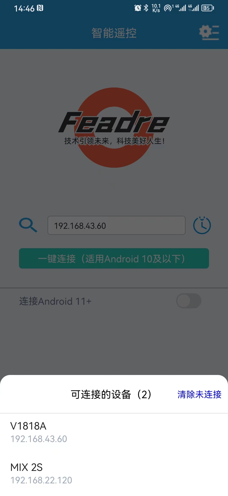
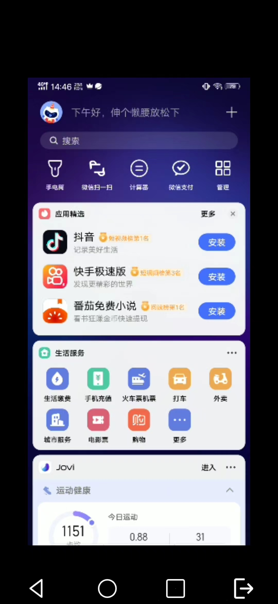
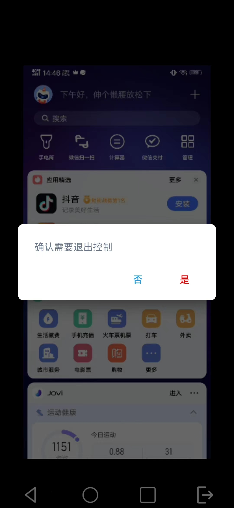
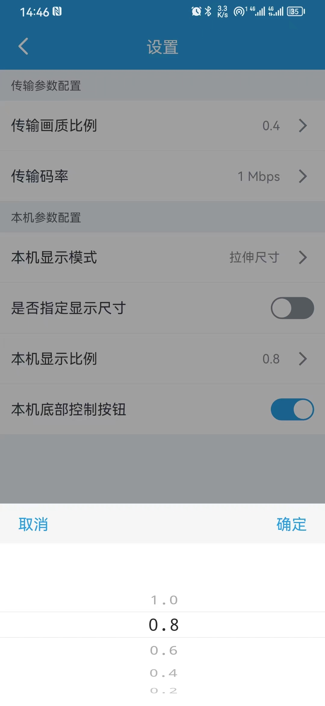

# Omni Control 智能遥控
智能遥控是基于 scrcpy 用于远程查看和控制安卓系统设备（手机、平板、电视、车机等）的一个安卓APP

## APP特点

1. 一键链接，降低使用成本：只需要输入已经打开ADB无线调试功能的设备IP，即可完成一键连接。
2. 快捷操作控制：控制支持安卓常用的返回、主页、应用切换功能和安卓手势功能。
3. ...

## APP截图

## 联系我们
有任何问题可联系我
  作者QQ号码： 27113970
       邮箱： zkbutt@qq.com
技术讨论QQ群： 551841192

## 参考引用
https://github.com/Genymobile/scrcpy
https://github.com/xuexiangjys/XUI
https://github.com/updeshxp/scrcpy-android
